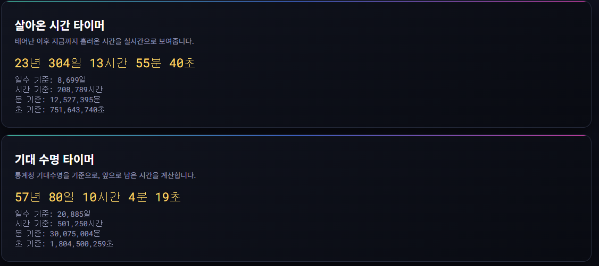
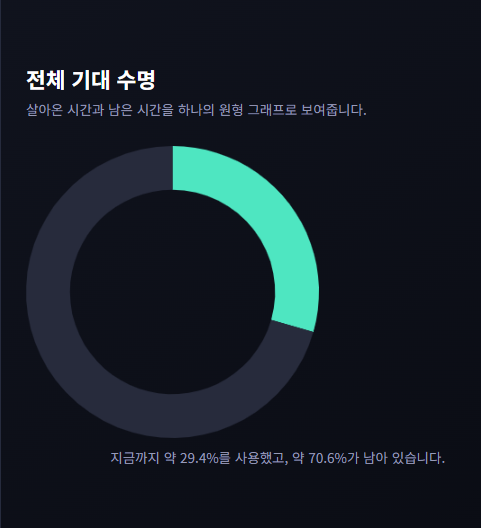
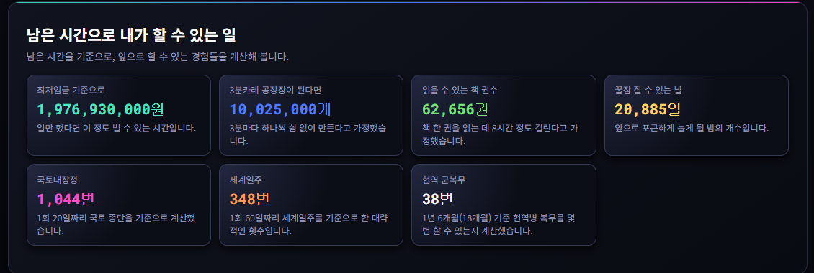
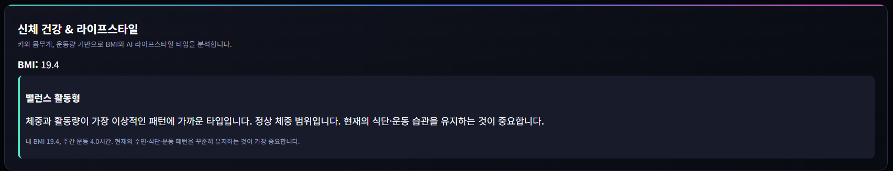
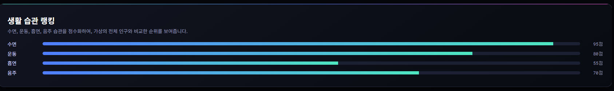
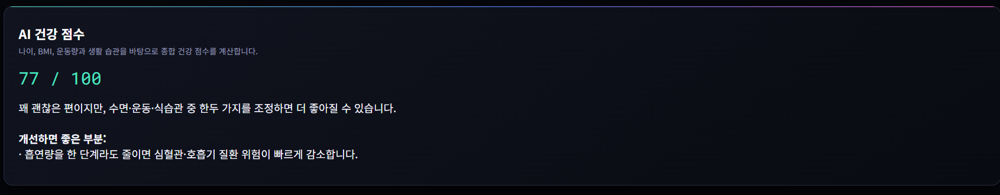
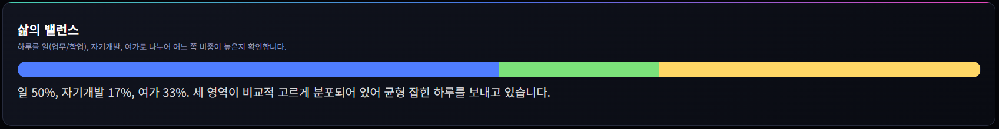
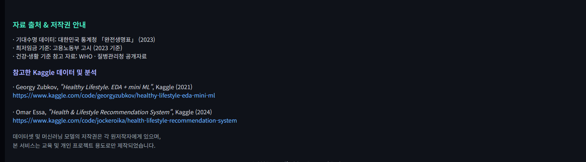

	# YourLife.GG — 개인 인생 분석 웹서비스
	개인의 생애 데이터를 기반으로 살아온 시간, 남은 시간, 건강 상태, 생활 습관, 기대수명 등을 분석해주는 웹 기반 인생 분석 서비스입니다.  
	본 프로젝트는 교육 및 개인 프로젝트 목적의 프론트엔드 웹 애플리케이션입니다.

	##  Live Demo
	**[https://your-username.github.io/yourlife-gg/](https://sw209.github.io/Open_Sourse_Software/)**

	---

	## 1. 프로젝트 개요
	YourLife.GG는 사용자의 생년월일, 성별, 신체 정보, 생활 습관 등을 입력받아  
	삶의 진행 상황을 시각적으로 분석합니다.  
	대한민국 통계청 생명표(2023), Kaggle 건강 데이터 분석 결과, 머신러닝 기반 점수 모델을 참조해  
	사용자의 건강 점수와 라이프스타일을 평가합니다.

	<p align="center">
	
	</p>

	---

	## 2. 주요 기능 (Features)

	### 2-1. 인생 타이머 (Life Timer)
	- 살아온 시간(년/일/시간/분/초) 계산
	- 대한민국 2023년 생명표 기반 기대수명 산출
	- 남은 시간 계산 및 전체 시간 대비 비율 시각화
	- Chart.js 도넛 차트로 시각적 표현

	<p align="center">
	
	</p>

	<p align="center">
	
	</p>

	### 2-2. 남은 시간으로 할 수 있는 활동 계산
	- 최저임금 기준 벌 수 있는 금액
	- 3분카레 제조 가능 개수
	- 읽을 수 있는 책 권수
	- 꿀잠 잘 수 있는 날 수
	- 국토대장정 가능한 횟수
	- 세계일주 가능한 횟수
	- 1년 6개월 기준 현역 병 복무 가능 횟수

	<p align="center">
	
	</p>

	### 2-3. BMI & 라이프스타일 분석
	- BMI 계산 및 범위별 피드백 제공
	- Kaggle 기반 ML 참고 모델로 라이프스타일 유형 분류
	- 운동량, 체중 등 기반 간단한 조언 제공

	<p align="center">
	
	</p>

<<<<<<< HEAD
	### 2-4. 생활습관 점수
	- 수면, 운동, 흡연, 음주 항목별 점수 부여
	- 시각적인 바 그래프 형태로 출력
	- 부족한 지표에 대한 개선 가이드 제공

	<p align="center">
	
	</p>

	### 2-5. AI 건강 점수
	- BMI, 운동시간, 수면, 흡연, 음주, 나이 종합 분석
	- 점수대별 설명과 개선 방향 제공
	
	<p align="center">
	
	</p>
=======
### Data & Model
- 대한민국 통계청 2023 완전생명표
- Kaggle Healthy Lifestyle 데이터 기반 ML 참고
- 커스텀 생활 습관 점수 모델
>>>>>>> d91d3b6061ce4c5c1de9d208435d6cb419bf65f4

	### 2-6. 삶의 밸런스 분석
	- 일/자기개발/여가 시간 비율 분석
	- 비율 기반 상세 설명 제공
	- 자동 막대 그래프 시각화 제공

	<p align="center">
	
	</p>

	### 2-7. 디자인
	- 어두운 테마 기반 네온 포인트 UI
	- 카드형 구성 인터페이스
	- 반응형 웹 디자인 적용

	---

	## 3. 자료 출처 및 관리

	### Data & Model
	- 대한민국 통계청 2023 완전생명표
	- Kaggle Healthy Lifestyle 데이터 기반 ML 참고
	- 커스텀 생활 습관 점수 모델

	<p align="center">
	
	</p>

	### Version Control
	- Git / GitHub

	---

<<<<<<< HEAD
## 4. 프로젝트 구조

```text
project/
├── index.html                     # 메인 페이지
├── style.css                      # 스타일 시트
├── app.js                         # 메인 스크립트
├── assets/                        # 스크린샷 / 이미지 폴더
├── health_score_model.json        # AI 건강 점수 모델 정의
├── lifestyle_model.json           # 라이프스타일 분석 모델 정의
├── Lifestyle_and_Health_dataset.csv  # 참고용 라이프스타일·건강 데이터셋
└── README.md
=======
## 3. 프로젝트 구조
project/
-│── index.html
-│── style.css
-│── app.js
-│── assets/ # 스크린샷/이미지 저장 폴더
-│── health_score_model.json
-│── lifestyle_model.json
-│── Lifestyle_and_Health_dataset.csv
-│── README.md
>>>>>>> d91d3b6061ce4c5c1de9d208435d6cb419bf65f4
